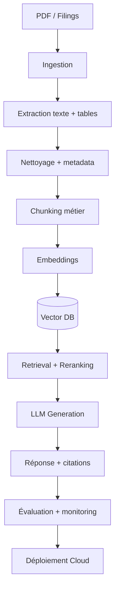

# Financial RAG Analyst BRVM

## Vision du projet
L'objectif n'est pas de construire un simple "chatbot PDF". Le projet vise à construire un véritable système d'analyse financière fiable capable de :
- Rechercher des informations dans des rapports financiers
- Retrouver précisément les bons passages
- Répondre avec des citations vérifiables
- Réduire les hallucinations
- Évaluer systématiquement la qualité du système
- Déployer une architecture exploitable en production

Le projet est aligné avec une approche **"AI systems for real-world decision-making"** car il met l'accent sur : la fiabilité, l'évaluation, le retrieval, les pipelines documentaires, les systèmes IA complets et les comportements réels du système.

---

## 1. Le problème réel
Les analystes financiers, risk analysts, auditeurs ou consultants travaillent avec :
- Rapports annuels
- États financiers
- Documents réglementaires
- Notes de risques
- Annexes
- Communiqués financiers

Ces documents sont souvent longs, complexes, hétérogènes et difficiles à rechercher rapidement.

### Les vrais problèmes métier

| Problème | Ce que le système doit résoudre |
| :--- | :--- |
| Rapports très longs | Recherche rapide multi-documents |
| Informations dispersées | Retrieval précis |
| PDF complexes | Extraction robuste texte + tables |
| Tableaux + texte mélangés | Structuration exploitable |
| LLM hallucinent | Réponses contrôlées |
| Réponses doivent être vérifiables | Citations précises |
| Besoin d'un système exploitable | API + monitoring + cloud |

Le vrai défi n'est donc pas de *"connecter un LLM à des PDF"*, mais de **construire un pipeline fiable, traçable, évalué et déployable**.

---

## 2. Objectif final du système
L'utilisateur pose une question :
> *What liquidity risks were mentioned in the 2024 annual report?*

Le système doit :
1. Retrouver les bons documents
2. Récupérer les bons passages
3. Générer une réponse fidèle
4. Citer précisément les sources
5. **Refuser de répondre** si l'information est absente

### Exemple de sortie attendue
```json
{
  "answer": "The main liquidity risks mentioned are refinancing pressure, short-term debt exposure and cash flow uncertainty.",
  "citations": [
    {
      "company": "Orange CI",
      "document": "annual_report_2024.pdf",
      "page": 42,
      "section": "Risk Factors"
    }
  ],
  "confidence": 0.84,
  "status": "answered"
}
```

### Exemple anti-hallucination
```json
{
  "answer": "Information not found in the provided documents.",
  "citations": [],
  "confidence": 0.21,
  "status": "not_found"
}
```
C'est cette logique **(réponse + preuve + refus si nécessaire)** qui rend le projet sérieux.

---

## 3. Scope MVP recommandé
Le projet doit commencer simple.

| Élément | Choix |
| :--- | :--- |
| Entreprises | 5 |
| Années | 2023–2024 |
| Documents | Rapports annuels |
| Langues | FR ou EN |
| Cas d'usage | Risques, dette, revenus, stratégie |

---

## 4. Sources de données

### SEC EDGAR
**Avantages :** données plus standardisées, APIs officielles, automatisation plus simple, données XBRL exploitables.
Très bon pour construire rapidement un MVP stable.

### BRVM (Bourse Régionale des Valeurs Mobilières)
**Avantages :** projet plus original (finance africaine), faible concurrence, forte différenciation portfolio.
**Inconvénients :** documents moins standardisés, extraction plus difficile, moins d'APIs.

**Stratégie recommandée :**
- **MVP** → SEC EDGAR pour finir vite.
- **Différenciation** → Extension BRVM pour se démarquer.

---

## 5. Architecture globale du système



---

## 6. PHASE 1 — Ingestion Hybride (RAW)
**Objectif :** Construire une ingestion fiable et multi-dimensionnelle (Textuelle + Quantitative).

Ce pipeline déterministe (sans LLM) collecte, vérifie, dédoublonne, stocke et audite trois types de données pour donner une vision 360° à l'IA :

| Source / Agent | Rôle |
| :--- | :--- |
| **BRVMSourceAgent** | Scraping et téléchargement des rapports PDF (États Financiers) |
| **SikaSourceAgent** | Ingestion de l'historique des cours de bourse et volumes (CSV) |
| **MacroSourceAgent** | Ingestion stricte des taux directeurs et de l'inflation (CSV) |
| **Quality/Storage** | Validation et génération des certificats d'audit (`manifest.json`) |
| **run_all.py** | Grand orchestrateur de la Phase 1 |

Les métadonnées et l'architecture "No-Silent-Fail" sont critiques pour assurer la traçabilité et éviter les hallucinations (données fausses ou obsolètes).

---

## 7. PHASE 2 — Extraction texte + tables
**Objectif :** Transformer les PDF en contenu exploitable (texte structuré, tables extraites).

| Outil | Usage |
| :--- | :--- |
| **PyMuPDF** | Extraction texte rapide |
| **pdfplumber** | Texte + tables |
| **Camelot** | Extraction tableaux |
| **Tesseract** | OCR pour scans |

### Architecture Agentique (sans LLM)
| Agent | Rôle |
| :--- | :--- |
| **PDFTextExtractionAgent** | Extrait le texte page par page |
| **TableExtractionAgent** | Extrait les tableaux financiers |
| **ExtractionQualityAgent** | Détecte les erreurs d'extraction |
| **ExtractionSupervisorAgent**| Orchestre l'extraction |

---

## 8. PHASE 3 — Nettoyage + metadata
**Objectif :** Transformer les données extraites en données propres.
Nettoyer (headers, espaces cassés, caractères invalides) et enrichir (entreprise, année, page, section).

| Agent | Rôle |
| :--- | :--- |
| **TextCleaningAgent** | Nettoie le texte |
| **MetadataEnrichmentAgent** | Enrichit les métadonnées |
| **TableCleaningAgent** | Nettoie les tableaux |
| **CleaningSupervisorAgent** | Orchestre le nettoyage |

---

## 9. PHASE 4 — Chunking métier
**Objectif :** Découper les documents intelligemment.
**Ne pas faire** un chunking basique de 500 tokens. Faire un chunking basé sur : sections, pages, types de contenu.

| Agent | Rôle |
| :--- | :--- |
| **SectionDetectionAgent** | Détecte les sections |
| **BusinessChunkingAgent** | Crée les chunks métier |
| **ChunkQualityAgent** | Vérifie les chunks |
| **ChunkingSupervisorAgent**| Orchestre le pipeline |

---

## 10. PHASE 5 — Embeddings
**Objectif :** Transformer les chunks en vecteurs.
Modèles suggérés : `multilingual-e5` (FR+EN) ou `BGE`.

| Agent | Rôle |
| :--- | :--- |
| **EmbeddingAgent** | Génère les embeddings |
| **EmbeddingQualityAgent** | Vérifie les embeddings |
| **EmbeddingSupervisorAgent**| Orchestre la génération |

---

## 11. PHASE 6 — Vector Database
**Objectif :** Indexer pour une recherche rapide.
**Recommandation :** `Qdrant` (scalable, metadata puissantes, orienté production).

| Agent | Rôle |
| :--- | :--- |
| **VectorIndexAgent** | Construit l'index |
| **IndexQualityAgent** | Vérifie l'index |
| **IndexSupervisorAgent**| Orchestre l'indexation |

---

## 12. PHASE 7 — Retrieval + Reranking
**Objectif :** Retrouver les meilleurs passages pour une question.

| Méthode | Description |
| :--- | :--- |
| **BM25** | Par mots-clés |
| **Dense** | Embeddings purs |
| **Hybrid** | BM25 + Dense |
| **Hybrid + Reranker** | **Version cible recommandée** |

### Benchmark obligatoire
L'évaluation du Retrieval (Recall@5, MRR, Latence) est indispensable.

| Agent | Rôle |
| :--- | :--- |
| **RetrieverAgent** | Récupère les chunks |
| **RerankerAgent** | Reclasse les résultats |
| **RetrievalEvalAgent** | Mesure le retrieval |
| **RetrievalSupervisorAgent**| Orchestre le retrieval |

---

## 13. PHASE 8 — Génération contrôlée
**Objectif :** Générer des réponses fiables avec citations (ici le LLM intervient).

| Agent | Rôle |
| :--- | :--- |
| **AnswerGenerationAgent** | Génère la réponse |
| **CitationAgent** | Vérifie les citations |
| **RefusalAgent** | Refuse de répondre si l'info manque |
| **GenerationSupervisorAgent**| Orchestre la génération |

---

## 14. PHASE 9 — Construction du dataset d'évaluation
Sans dataset de vérité terrain, impossible de tester correctement.
Objectif : **50 questions de haute qualité** (Factuelle, Risque, Comparaison, Synthèse, Localisation, *Questions Impossibles* pour tester le refus).

---

## 15. PHASE 10 — Évaluation système
**Métriques Retrieval :** Recall@5, MRR, Precision@5, Context Recall.
**Métriques Génération :** Faithfulness, Groundedness, Taux d'hallucination, Précision des citations.

---

## 16. PHASE 11 — Monitoring
Observer le comportement réel : Latence, performance, taux de refus, scores des chunks retrouvés.

---

## 17. PHASE 12 — API + Frontend + Cloud
- **API :** FastAPI (endpoints `/ask`, `/health`, `/metrics`)
- **Frontend :** Streamlit (réponses, citations, source, confiance)

---

## 18. Déploiement Cloud
| Besoin | Service Recommandé |
| :--- | :--- |
| Stockage | Cloud Storage |
| API | Cloud Run |
| Embeddings | Vertex AI |
| Logs | BigQuery |

---

## 19. Structure GitHub Finale
```text
financial-rag-analyst/
├── app/
│   ├── ingest/
│   ├── extraction/
│   ├── cleaning/
│   ├── chunking/
│   ├── embeddings/
│   ├── retrieval/
│   ├── reranking/
│   ├── generation/
│   ├── evaluation/
│   └── monitoring/
├── api/
├── frontend/
├── data/
├── tests/
├── Dockerfile
├── requirements.txt
└── README.md
```

---

## 20. À retenir en Entretien
> "Le vrai défi n'était pas de connecter un LLM à des PDF. Le défi était de construire un pipeline fiable : ingestion robuste, extraction correcte, metadata traçables, retrieval évalué, réduction des hallucinations, réponses sourcées, monitoring et déploiement."

**Phrase CV :**
> *Built and deployed a reliable financial RAG system over annual reports, with structured ingestion, document extraction, section-aware chunking, hybrid retrieval, reranking, source-grounded answers, RAG evaluation, monitoring and cloud deployment.*

---

## Exemples d'exécution (Ingestion Phase 1)

Pour tout télécharger (Bourse, Macro, PDFs) :
```bash
python -m app.ingest.run_all
```

Tester la récupération des cours de bourse :
```bash
python -m app.ingest.run_all --only-sika --probe
```

Cibler l'ingestion des rapports PDF pour toutes les entreprises sur une année :
```bash
python -m app.ingest.run_all --only-brvm --years "2024" --limit 4
```

Cibler l'ingestion pour une entreprise précise sur plusieurs années :
```bash
python -m app.ingest.run_all --only-brvm --companies "CIE CI" --years "2024" --limit 2 --max-pages 1 --verbose
```
```bash
python -m app.ingest.run_all --only-brvm --companies "CIE CI, SONATEL" --years "2022-2024"
```
